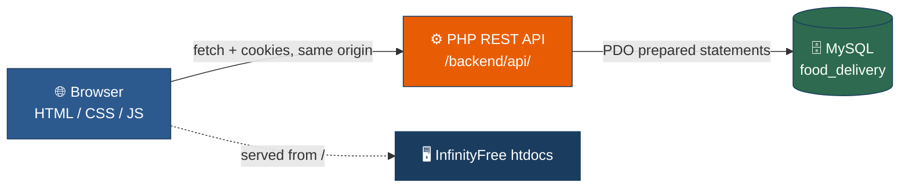
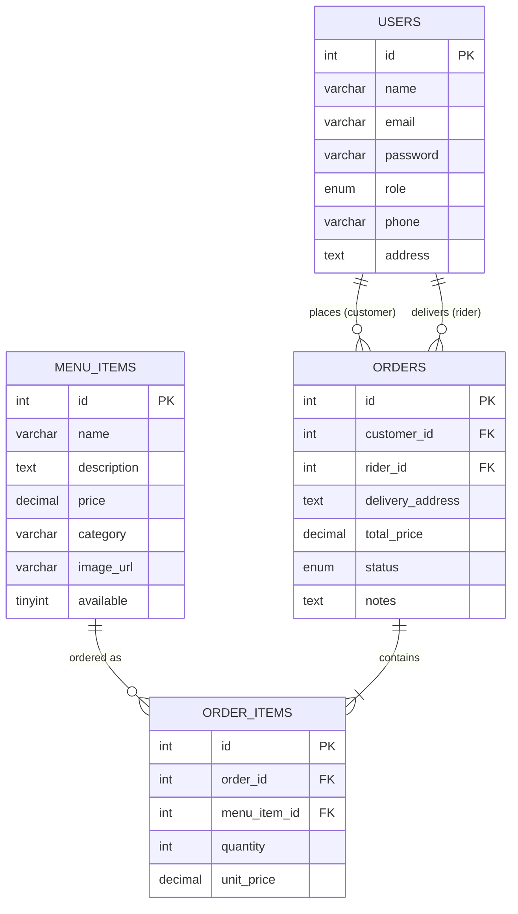

<div align="center">

# 🍜 FreshGo — Food Delivery Management System

### A full-stack food ordering & delivery platform built with vanilla HTML, CSS, JS, PHP & MySQL

[](LICENSE)


*A university project demonstrating HTML5, CSS3, JavaScript, PHP, MySQL, and free PHP hosting deployment.*

</div>

---

## 📖 Table of Contents

1. [Overview](#-overview)
2. [Features](#-features)
3. [Tech Stack](#️-tech-stack)
4. [Architecture](#-architecture)
5. [Project Structure](#-project-structure)
6. [Database Schema](#️-database-schema)
7. [API Reference](#-api-reference)
8. [Design System](#-design-system)
9. [Authentication & Roles](#-authentication--roles)
10. [Local Development (XAMPP)](#-local-development-xampp)
11. [Deployment (InfinityFree)](#️-deployment-infinityfree)
12. [Manual Testing Checklist](#-manual-testing-checklist)
13. [Course Requirement Mapping](#-course-requirement-mapping)
14. [Troubleshooting](#-troubleshooting)
15. [Contributing](#-contributing)
16. [License](#-license)

---

## ✨ Overview

**FreshGo** is a three-role food delivery management system built entirely with **vanilla web technologies** — no frameworks, no build tools, no npm dependencies in the frontend. Frontend and backend are deployed **together, from the same origin**, on a single free PHP host (InfinityFree) — see [Architecture](#-architecture) for why.

| Role | What they can do |
|---|---|
| 🛠️ **Admin** | Manage the menu, view & update all orders, assign riders, manage rider accounts, monitor live KPIs |
| 🛒 **Customer** | Browse the menu, build a cart, check out, track order status live |
| 🛵 **Rider** | View assigned deliveries, advance order status through to delivered |

---

## 🚀 Features

- 🔐 **Session-based authentication** with bcrypt-hashed passwords and role-based access control
- 🍽️ **Menu management** — full CRUD with image preview, category filters, and availability toggles
- 🧾 **Order lifecycle** — `pending → preparing → out_for_delivery → delivered` (or `cancelled`)
- 🛵 **Rider assignment** — admins assign riders to orders; riders advance their own deliveries
- 📊 **Live admin dashboard** — KPI cards auto-refresh every **30s**
- 📍 **Live order tracking** — customer tracking page polls every **20s** with a visual progress bar
- 🛒 **Persistent cart** — stored in `localStorage`, survives page reloads
- 🔔 **Toast notifications** — every success/error state is user-visible, never silent
- 📱 **Responsive UI** — collapsible sidebar on mobile, fluid grid layouts
- 🧱 **Defensive backend** — PDO prepared statements, transactions for order placement, consistent JSON error contracts

---

## 🛠️ Tech Stack

| Layer | Technology | Purpose |
|---|---|---|
| 🎨 Frontend | HTML5, CSS3, Vanilla JavaScript (ES2017+) | Semantic markup, Flexbox/Grid layouts, Fetch API |
| ⚙️ Backend | PHP 8.x | REST-style JSON API, `$_SESSION` auth |
| 🗄️ Database | MySQL / MariaDB | Relational schema with foreign keys & transactions |
| 🖥️ Hosting | InfinityFree | Free PHP + MySQL hosting (Apache), serves frontend and backend together |
| 🧰 Local Dev | XAMPP | Local Apache/MySQL/PHP stack, same single-origin layout as production |

> No React, Vue, jQuery, Tailwind, or build pipeline — every line of HTML/CSS/JS is hand-written, by design, to satisfy the course's "implement from first principles" requirement.

---

## 🏗️ Architecture

```
┌────────────────────────────────────────────────────────────┐
│                     Browser (any device)                   │
│             HTML5 · CSS3 · Vanilla JavaScript               │
└───────────────────────────┬──────────────────────────────────┘
                            │  fetch() · credentials: 'include'
                            │  same origin — no CORS
                            ▼
┌────────────────────────────────────────────────────────────┐
│      https://yoursubdomain.infinityfreeapp.com/            │
│  /              → static frontend (this is the htdocs root) │
│  /backend/api/  → PHP 8.x REST API (Apache + PDO)            │
│     auth/ · menu/ · orders/ · riders/ · stats/               │
└───────────────────────────┬──────────────────────────────────┘
                            │  PDO (prepared statements)
                            ▼
┌────────────────────────────────────────────────────────────┐
│              MySQL / MariaDB — `food_delivery`             │
│         users · menu_items · orders · order_items           │
│              (managed via phpMyAdmin)                       │
└────────────────────────────────────────────────────────────┘
```



> **Why single-origin, not split hosting?** This project originally split the frontend (Firebase Hosting) from the backend (InfinityFree) — the more "textbook" architecture for demonstrating a decoupled REST API. In practice, InfinityFree's free tier routes all HTTPS traffic through a shared edge layer that blocks cross-origin programmatic requests outright (confirmed via direct testing — `OPTIONS`/`GET` requests carrying an `Origin` header never reached `.htaccess` or PHP at all, regardless of CORS configuration). Since that's infrastructure we don't control, the only durable fix was to stop being cross-origin: serve the frontend from the same host as the API. Same-origin requests are never subject to CORS, so this isn't a workaround — it's a strictly simpler architecture with an entire category of bugs (CORS preflight, `SameSite` cookie rules) permanently off the table.

---

## 📂 Project Structure

The repo keeps `frontend/` and `backend/` as separate top-level folders for clarity, but **they're deployed together into the same web root** — see [Deployment](#️-deployment-infinityfree).

```
JR Web/
├── 📄 README.md
├── 📄 LICENSE
├── 📄 BLUEPRINT.md                  ← original implementation spec
│
├── 📁 backend/                      ← deployed as htdocs/backend/
│   ├── .htaccess                    ← security flags (no CORS — same-origin)
│   ├── schema.sql                   ← full DB schema + seed data
│   ├── config/
│   │   └── db.php                   ← PDO connection singleton
│   ├── helpers/
│   │   ├── response.php             ← json_response() / error_response() / start_session()
│   │   ├── auth.php                 ← require_role() / current_user()
│   │   └── validate.php             ← require_fields() / sanitize()
│   └── api/
│       ├── auth/        → login · logout · register · session
│       ├── menu/         → index (list/create) · item (get/update/delete)
│       ├── orders/       → index (list/place) · item (get/update) · my · assigned
│       ├── riders/       → index (list/create) · assign
│       └── stats/        → index (dashboard KPIs)
│
└── 📁 frontend/                     ← deployed as htdocs/ (contents go to web root)
    ├── index.html                   ← login / register
    ├── css/
    │   ├── style.css                ← variables, reset, buttons, forms, toasts
    │   ├── components.css           ← cards, tables, sidebar, badges
    │   └── pages/                   ← auth.css · admin.css · customer.css · rider.css
    ├── js/
    │   ├── config.js                ← API_BASE — single source of truth
    │   ├── api.js                   ← apiFetch() central fetch wrapper
    │   ├── auth.js                  ← sessionGuard() / logout()
    │   ├── utils.js                 ← toasts, formatters, field errors
    │   └── cart.js                  ← localStorage cart helpers
    ├── admin/      → dashboard · orders · menu · riders
    ├── customer/    → menu · cart · track
    └── rider/       → deliveries
```

---

## 🗄️ Database Schema



Full SQL is in [`backend/schema.sql`](backend/schema.sql) — import it via phpMyAdmin's SQL tab. It also seeds:

- 🔑 Default admin: `admin@food.com` / `FreshGo#Adm1n26`
- 🍛 5 sample menu items (Nasi Lemak, Char Kway Teow, Roti Canai, Teh Tarik, Milo Ais)

---

## 🔌 API Reference

> All responses are `Content-Type: application/json`. Errors always return `{"error": "message"}` with an appropriate HTTP status code.
>
> **Method override:** `PUT` and `DELETE` requests are sent over the wire as `POST` with the real method folded into the JSON body as `_method` (e.g. `{"status": "delivered", "_method": "PUT"}`) — `frontend/js/api.js` does this automatically, and the three affected endpoints (`menu/item.php`, `orders/item.php`, `riders/assign.php`) read it from there. This isn't a CORS workaround (the app is single-origin, so CORS never applies) — it's because InfinityFree doesn't reliably deliver the request body to PHP's `php://input` for genuine `PUT` requests, only `POST`. The table below lists the *logical* method for clarity.

### Auth — `/api/auth/`

| Method | Endpoint | Auth | Description |
|---|---|---|---|
| `POST` | `login.php` | — | Authenticate, start session |
| `POST` | `logout.php` | any | Destroy session |
| `POST` | `register.php` | — | Create a new **customer** account |
| `GET` | `session.php` | any | Return current session user |

### Menu — `/api/menu/`

| Method | Endpoint | Auth | Description |
|---|---|---|---|
| `GET` | `index.php` | — | List all menu items |
| `POST` | `index.php` | 🛠️ admin | Create a menu item |
| `GET` | `item.php?id=N` | — | Get one menu item |
| `PUT` | `item.php?id=N` | 🛠️ admin | Update a menu item |
| `DELETE` | `item.php?id=N` | 🛠️ admin | Delete a menu item |

### Orders — `/api/orders/`

| Method | Endpoint | Auth | Description |
|---|---|---|---|
| `GET` | `index.php` | 🛠️ admin | List all orders (joined with customer/rider) |
| `POST` | `index.php` | 🛒 customer | Place an order (transactional) |
| `GET` | `item.php?id=N` | any owner | Order detail + line items |
| `PUT` | `item.php?id=N` | 🛠️/🛵 | Update order status |
| `GET` | `my.php` | 🛒 customer | Orders for the logged-in customer |
| `GET` | `assigned.php` | 🛵 rider | Orders assigned to the logged-in rider |

### Riders — `/api/riders/`

| Method | Endpoint | Auth | Description |
|---|---|---|---|
| `GET` | `index.php` | 🛠️ admin | List all rider accounts |
| `POST` | `index.php` | 🛠️ admin | Create a rider account |
| `PUT` | `assign.php` | 🛠️ admin | Assign a rider to an order |

### Stats — `/api/stats/`

| Method | Endpoint | Auth | Description |
|---|---|---|---|
| `GET` | `index.php` | 🛠️ admin | KPI counts for the dashboard |

---

## 🎨 Design System

<table>
<tr><th>Swatch</th><th>Token</th><th>Hex</th><th>Usage</th></tr>
<tr><td>🟦</td><td><code>--color-primary</code></td><td><code>#1A3C5E</code></td><td>Sidebar, headings, primary buttons</td></tr>
<tr><td>🔷</td><td><code>--color-primary-light</code></td><td><code>#2D5A8E</code></td><td>Hover states</td></tr>
<tr><td>🟧</td><td><code>--color-accent</code></td><td><code>#E85D04</code></td><td>CTAs — "Add to Cart", "Place Order"</td></tr>
<tr><td>🟠</td><td><code>--color-accent-light</code></td><td><code>#FB8B24</code></td><td>Accent hover</td></tr>
<tr><td>🟩</td><td><code>--color-success</code></td><td><code>#2D6A4F</code></td><td>Delivered status, success toasts</td></tr>
<tr><td>⬜</td><td><code>--color-bg</code></td><td><code>#F8FAFC</code></td><td>App background</td></tr>
<tr><td>🟥</td><td><code>--color-danger</code></td><td><code>#DC2626</code></td><td>Errors, delete actions, cancelled status</td></tr>
</table>

**Typography:** [Inter](https://fonts.google.com/specimen/Inter) (400/500/600/700) · base `16px` · line-height `1.6`

**Components:** rounded cards (`--radius-md: 12px`), pill badges per order status, slide-in toasts, animated modals, CSS-only spinners, collapsible mobile sidebar drawer.

| Status | Badge |
|---|---|
| Pending | 🟡 amber |
| Preparing | 🔵 blue |
| Out for Delivery | 🟣 purple |
| Delivered | 🟢 green |
| Cancelled | 🔴 red |

---

## 🔐 Authentication & Roles

- Sessions are managed server-side via PHP `$_SESSION`; the frontend mirrors minimal identity info (`id`, `name`, `role`) in `sessionStorage` for fast UI gating.
- Every protected page calls `sessionGuard(requiredRole)` **before** rendering — it verifies the session with the backend, redirects unauthenticated users to `/index.html`, and redirects users with the wrong role.
- Passwords are hashed with `password_hash(..., PASSWORD_DEFAULT)` (bcrypt) and verified with `password_verify()` — never logged, never stored client-side.
- API authorization is enforced **server-side** in every endpoint via `require_role()` — the frontend role-gating is a UX convenience, not the security boundary.
- The session cookie is always same-origin (frontend and backend share one host — see [Architecture](#-architecture)), so `helpers/response.php`'s `start_session()` uses plain `SameSite=Lax`. It still adapts `Secure` to whether the request is HTTPS, so the cookie isn't sent insecurely if the site is ever served over plain HTTP.

| Role | Default landing page |
|---|---|
| 🛠️ admin | `/admin/dashboard.html` |
| 🛒 customer | `/customer/menu.html` |
| 🛵 rider | `/rider/deliveries.html` |

---

## 🖥️ Local Development (XAMPP)

Frontend and backend are served from **one** XAMPP project folder, mirroring exactly how production is laid out — there's no separate static-file server (Live Server, etc.) involved anymore.

1. Install [XAMPP](https://www.apachefriends.org/) (Apache + MySQL + PHP).
2. Get the project onto the machine (clone the repo, or copy it some other way) — anywhere outside `htdocs` is fine, e.g. `C:\Projects\freshgo\`.
3. Create the combined project folder and copy both halves into it:
   ```powershell
   New-Item -ItemType Directory -Force C:\xampp\htdocs\freshgo
   Copy-Item -Path "C:\Projects\freshgo\frontend\*" -Destination "C:\xampp\htdocs\freshgo" -Recurse
   Copy-Item -Path "C:\Projects\freshgo\backend" -Destination "C:\xampp\htdocs\freshgo" -Recurse
   ```
   Note the asymmetry: `frontend\*` (its **contents**, landing directly in `freshgo\`) vs `backend` (the **folder itself**, landing as `freshgo\backend\`). Mixing these up is the single most common mistake in this whole setup.
4. **Verify the layout before doing anything else:**
   ```powershell
   Get-ChildItem C:\xampp\htdocs\freshgo
   ```
   You should see `index.html`, `css`, `js`, `admin`, `customer`, `rider`, **and** `backend` all directly inside `freshgo\`. If `backend` is missing, or if there's a `freshgo\backend\backend\...` nesting, redo step 3.
5. Start **Apache** and **MySQL** from the XAMPP Control Panel.
6. **Sanity-check the backend before touching the frontend at all.** Open this directly in a browser tab:
   ```
   http://localhost/freshgo/backend/api/menu/index.php
   ```
   Expect a JSON array (`[]` if the DB isn't set up yet). A 404 means step 3/4 went wrong — fix that before continuing.
7. Open `http://localhost/phpmyadmin`, create a database, and import [`backend/schema.sql`](backend/schema.sql).
8. Edit `db.php` **in your htdocs copy** (`C:\xampp\htdocs\freshgo\backend\config\db.php`, not the one in your repo checkout) — default XAMPP is host `localhost`, user `root`, password empty.
9. Re-check step 6's URL — it should now return your 5 seeded menu items.
10. Confirm `frontend/js/config.js` (in your htdocs copy) has the local line active:
    ```js
    const API_BASE = '/freshgo/backend/api';
    ```
11. Browse to `http://localhost/freshgo/index.html` and log in with `admin@food.com` / `FreshGo#Adm1n26`.

---

## ☁️ Deployment (InfinityFree)

Same idea as local dev: both halves go into the **same** htdocs, frontend at the root and backend as a subfolder.

1. Create a free account at [infinityfree.com](https://infinityfree.com) and a new hosting account.
2. In **VistaPanel → MySQL Databases**, create a database and note the host, name, user, and password.
3. Open **phpMyAdmin** from VistaPanel and run [`backend/schema.sql`](backend/schema.sql).
4. Fill in the four constants in `backend/config/db.php` with your real credentials.
5. Upload via VistaPanel File Manager or FileZilla (`ftpupload.net`, port 21):
   - The **contents** of `frontend/` go directly into `htdocs/`.
   - The entire `backend/` **folder** also goes into `htdocs/`, landing as `htdocs/backend/`.
6. In `frontend/js/config.js`, make sure the production line is active:
   ```js
   const API_BASE = '/backend/api';
   ```
7. Verify: visiting `https://yoursubdomain.infinityfreeapp.com/backend/api/menu/index.php` should return `[]` or your seeded items, and `https://yoursubdomain.infinityfreeapp.com/` should load the login page.
8. Log in from the real deployed site (not just the direct API URL) and confirm the dashboard loads data — this is the step that actually exercises the same-origin `fetch()` flow.

### Redeploying after changes

Re-upload whichever changed files via VistaPanel File Manager, FileZilla, or the VS Code FTP-Simple extension — frontend and backend are just files in the same `htdocs/`, no build step either way.

---

## ✅ Manual Testing Checklist

- [ ] Register a new customer → auto-login → redirected to `/customer/menu.html`
- [ ] Log out → log back in as admin (`admin@food.com` / `FreshGo#Adm1n26`)
- [ ] Admin: add a menu item with an image URL → preview renders → item appears in grid
- [ ] Admin: toggle an item's availability → toggle persists on reload
- [ ] Customer: add items to cart → badge count updates → checkout with an address
- [ ] Admin: see the new order on **Orders** → change status → assign a rider
- [ ] Admin: see KPI cards and recent orders update automatically after 30s
- [ ] Rider: log in → see the assigned order under **Active** → mark Out for Delivery → mark Delivered
- [ ] Customer: **Track** page shows the progress bar advancing, polling every 20s
- [ ] Try invalid login, empty fields, mismatched passwords → inline errors appear, no blank screens
- [ ] Disconnect network and submit a form → "Cannot connect to server" toast appears

---

## 📋 Course Requirement Mapping

| Requirement | Implementation | Where |
|---|---|---|
| HTML5 | Semantic tags, form validation attributes | All `.html` pages |
| CSS3 | Custom properties, Flexbox, Grid, transitions | `style.css` + page styles |
| JavaScript | Fetch API, DOM manipulation, validation, `setInterval` polling | `js/*.js` + inline page scripts |
| PHP | REST endpoints, sessions, PDO prepared statements | `backend/api/*.php` |
| MySQL | Relational schema, JOINs, foreign keys, transactions | `food_delivery` database |
| Web Server | Apache on InfinityFree, serving frontend + backend together | InfinityFree htdocs |

---

## 🩹 Troubleshooting

| Symptom | Likely Cause | Fix |
|---|---|---|
| 404 on `freshgo/backend/api/...` (local) or `backend/api/...` (prod), even though the frontend loads fine | `backend/` got copied as its *contents* instead of as a *folder*, or vice versa for `frontend/` — see the asymmetry called out in [Local Development](#-local-development-xampp) step 3 / [Deployment](#️-deployment-infinityfree) step 5 | Run `Get-ChildItem` on the htdocs folder — you should see frontend files (`index.html`, `css`, `js`, ...) **and** a `backend` folder, all at the same level. Fix whichever side is nested wrong |
| Login always returns *"Invalid email or password"* even with the documented credentials | The seeded bcrypt hash in `schema.sql` simply didn't correspond to the documented password — never verified until it was checked with a real bcrypt library | Use the current hash in `backend/schema.sql` (password is `FreshGo#Adm1n26`). If your database was seeded before this fix, run: `UPDATE users SET password = '<hash from schema.sql>' WHERE email = 'admin@food.com';` |
| "Cannot connect to server" toast on every action | `API_BASE` in `frontend/js/config.js` doesn't match where you actually put the backend | Local dev should be `/freshgo/backend/api`; production should be `/backend/api`. Both are relative paths — there's no hostname to get wrong anymore, just the path |
| Blank JSON `{"error":"Database connection failed"}` | Wrong credentials in `db.php` | Re-check host/name/user/pass against what you set up in phpMyAdmin/VistaPanel |
| You're hitting a CORS error in the console at all | Something is making a genuinely cross-origin request — e.g. opening the frontend HTML file directly from disk (`file://...`) instead of through `http://localhost/freshgo/...`, or a stray absolute URL somewhere instead of a relative `API_BASE` | Always access the app through the web server, not by double-clicking an HTML file. Confirm `config.js` uses a relative path, not a full `https://...` URL pointing at a different host |
| 400 *"Status field is required"* / *"order_id and rider_id are required"* on order status updates or rider assignment, even though you filled in the form correctly | InfinityFree doesn't reliably deliver the request body to `php://input` for genuine `PUT` requests — only `POST` works | Already handled: `api.js` sends `PUT`/`DELETE` as `POST` with `_method` in the body (see the note in [API Reference](#-api-reference)). If you add a new endpoint needing `PUT`/`DELETE`, follow the same pattern instead of reading the body directly off a real `PUT`/`DELETE` request |

---

## 🤝 Contributing

This is a university group project. Suggested workflow for teammates:

1. Pull the latest changes.
2. Run the backend locally via XAMPP (see [Local Development](#-local-development-xampp)).
3. Make your changes and test the golden path manually (see [checklist](#-manual-testing-checklist)).
4. Commit with a clear message and push.

| Role | Name |
|---|---|
| 🛠️ Backend / Database | _add your name_ |
| 🎨 Frontend / UI | _add your name_ |
| 🧪 Testing / QA | _add your name_ |

---

## 📄 License

This project is licensed under the **MIT License** — see [`LICENSE`](LICENSE) for details.

<div align="center">

Made with 🍜, ☕, and a deadline by a small uni team.

</div>
